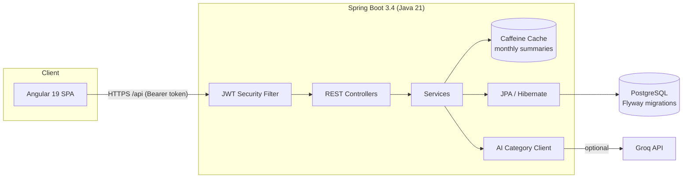

# Spendly

Personal expense tracker with Spring Boot + Angular.

**Live:** https://spendly-33ek.onrender.com

**Stack:** Java 21, Spring Boot, JWT, JPA/Hibernate, Flyway, PostgreSQL, Angular, Docker, GitHub Actions, Testcontainers, Caffeine, Groq AI

[](https://github.com/zaker1998/Spendly-Personal-Expense-Tracker/actions/workflows/ci.yml)

> The live demo runs on Render's free tier — the first request after idle can take up to a minute while the instance wakes up.

## Features

- Register / login (JWT), roles: `USER` and `ADMIN`
- Expenses & categories CRUD
- **AI category suggestion** — an LLM (with keyword-heuristic fallback) suggests the right category from the expense description
- Filters + pagination on expense list
- Monthly dashboard with month picker + category chart, **cached with Caffeine**
- Budgets with progress / over-budget
- CSV export
- **Rate limiting** on auth + AI endpoints (per-IP fixed window, HTTP 429 + `Retry-After`)
- Consistent JSON errors: structured 400s for bad input, 401/403 bodies, no leaking 500s
- Admin UI (users + all expenses)
- Swagger UI
- Unit tests + integration tests against real PostgreSQL via Testcontainers
- `docker compose` for local run

## Architecture



### Design decisions

- **JWT (stateless) over sessions** — the API stays horizontally scalable and the SPA keeps a single token; short expiry + HTTPS mitigate token theft.
- **Flyway with `ddl-auto: validate`** — the schema is owned by versioned SQL migrations, never by Hibernate auto-DDL; production and tests run identical schemas.
- **AI suggestions are validated server-side** — the LLM is asked to pick from the user's own category names, and its answer is checked against the database before being returned. A hallucinated category can never reach the client. On any provider failure (timeout, rate limit, missing key) the endpoint degrades to a keyword heuristic instead of erroring.
- **Caffeine instead of Redis for caching** — the app runs as a single instance, so an in-process cache gives the same latency win without extra infrastructure. Writes evict exactly the affected user+month entry, not the whole cache; a 10-minute TTL bounds staleness.
- **Testcontainers over H2 for integration tests** — tests run against the same PostgreSQL version as production, so dialect-specific behaviour (e.g. in filtered queries) is actually covered.
- **In-memory rate limiting** — login/register and the AI endpoint are the two abuse targets (credential brute-force, external API quota). A per-IP fixed window in process memory is enough for a single instance — same reasoning as Caffeine over Redis.

## Run locally

```bash
docker compose up --build
```

| | URL |
|--|--|
| App | http://localhost:4200 |
| API | http://localhost:8081/api |
| Swagger | http://localhost:8081/swagger-ui.html |

Postgres is on host port **5433**, API on **8081** (so they don't clash with other local containers).

### Demo users

| Email | Password | Role |
|-------|----------|------|
| `demo@spendly.app` | `Demo123!` | USER |
| `admin@spendly.app` | `Admin123!` | ADMIN |

### AI suggestions (optional, Groq)

Uses Groq’s free API by default. Get a key at [console.groq.com](https://console.groq.com/keys).

```bash
AI_API_KEY=gsk_... docker compose up --build
```

On Render: set only `AI_API_KEY` to your Groq key. Base URL and model already default in the app config.

Without a key, *Suggest category* still works via the keyword heuristic.

| Env var | Default | Purpose |
|---------|---------|---------|
| `AI_API_KEY` | *(empty — heuristic only)* | Groq API key |
| `AI_MODEL` | `llama-3.1-8b-instant` | Optional override |
| `AI_SUGGESTIONS_ENABLED` | `true` | Kill switch |

### Rate limiting

| Env var | Default | Purpose |
|---------|---------|---------|
| `RATE_LIMIT_ENABLED` | `true` | Kill switch |
| `RATE_LIMIT_AUTH_PER_MINUTE` | `10` | Per IP, `/api/auth/**` |
| `RATE_LIMIT_AI_PER_MINUTE` | `30` | Per IP, AI suggestions |

## Screenshots


## Project layout

```
backend/     Spring Boot API
frontend/    Angular app
Dockerfile   optional all-in-one image (SPA + API)
render.yaml  optional Render blueprint
```

## Dev without full Compose

```bash
# DB
docker compose up postgres -d

# API
cd backend
SPRING_DATASOURCE_URL=jdbc:postgresql://localhost:5433/spendly mvn spring-boot:run

# UI
cd frontend
npm install
npm start
```

Frontend expects the API at `http://localhost:8080/api` in dev.

## API

| Method | Path | Notes |
|--------|------|--------|
| POST | `/api/auth/register` | |
| POST | `/api/auth/login` | |
| GET/POST/PUT/DELETE | `/api/categories` | |
| GET/POST/PUT/DELETE | `/api/expenses` | query params for filters |
| POST | `/api/expenses/suggest-category` | AI / heuristic category suggestion |
| GET | `/api/expenses/export` | CSV download |
| GET/POST/PUT/DELETE | `/api/budgets` | monthly limits |
| GET | `/api/summary/monthly` | cached (Caffeine, 10 min TTL) |
| GET | `/api/admin/users` | ADMIN |
| GET | `/api/admin/expenses` | ADMIN |

## Tests

```bash
cd backend
mvn test
```

Unit tests (Mockito) cover services including the AI suggestion fallback logic and the rate limiter; integration tests (Testcontainers + MockMvc) exercise the full HTTP → database path against real PostgreSQL, including security behaviour: 401 for anonymous requests, 400 (not 500) for invalid query params, and cross-user isolation (user B cannot read user A's expense).

## License

MIT
