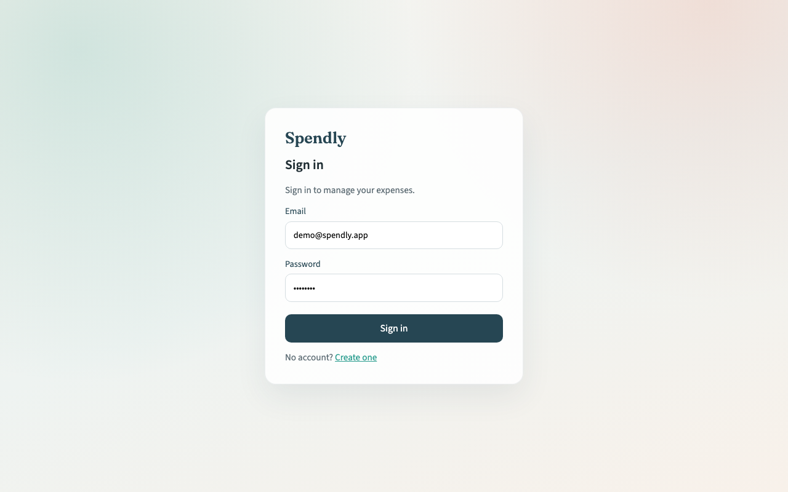

# Spendly

Personal expense tracker with Spring Boot + Angular.

**Stack:** Java 21, Spring Boot, JWT, JPA/Hibernate, Flyway, PostgreSQL, Angular, Docker, GitHub Actions, Testcontainers

[](https://github.com/zaker1998/Spendly-Personal-Expense-Tracker/actions/workflows/ci.yml)

## Features

- Register / login (JWT), roles: `USER` and `ADMIN`
- Expenses & categories CRUD
- Filters + pagination on expense list
- Monthly summary by category
- Swagger UI
- Tests with Testcontainers
- `docker compose` for local run

## Run locally

```bash
docker compose up --build
```

| | URL |
|--|--|
| App | http://localhost:4200 |
| API | http://localhost:8081/api |
| Swagger | http://localhost:8081/swagger-ui.html |

Postgres is on host port **5433**, API on **8081** (so they don't clash with other local containers).

### Demo users

| Email | Password | Role |
|-------|----------|------|
| `demo@spendly.app` | `Demo123!` | USER |
| `admin@spendly.app` | `Admin123!` | ADMIN |

## Screenshots




## Project layout

```
backend/     Spring Boot API
frontend/    Angular app
Dockerfile   optional all-in-one image (SPA + API)
render.yaml  optional Render blueprint
```

## Dev without full Compose

```bash
# DB
docker compose up postgres -d

# API
cd backend
SPRING_DATASOURCE_URL=jdbc:postgresql://localhost:5433/spendly mvn spring-boot:run

# UI
cd frontend
npm install
npm start
```

Frontend expects the API at `http://localhost:8080/api` in dev.

## API

| Method | Path | Notes |
|--------|------|--------|
| POST | `/api/auth/register` | |
| POST | `/api/auth/login` | |
| GET/POST/PUT/DELETE | `/api/categories` | |
| GET/POST/PUT/DELETE | `/api/expenses` | query params for filters |
| GET | `/api/summary/monthly` | |
| GET | `/api/admin/users` | ADMIN |
| GET | `/api/admin/expenses` | ADMIN |

## Tests

```bash
cd backend
mvn test
```

## License

MIT
